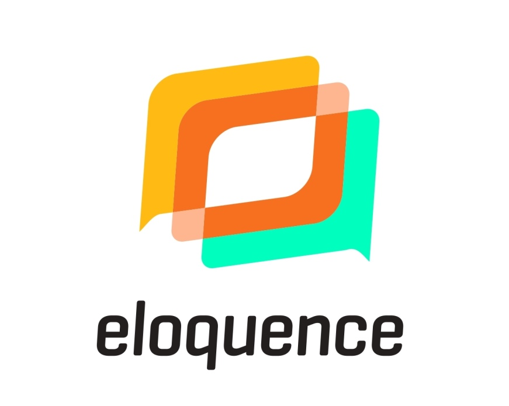

## Introduction
The ELOQUENCE project is an initiative focused on advancing AI-driven voice and chat bot technologies. Its goal is to transform unstructured dialogues into clear, safe, and unbiased interactions. ELOQUENCE emphasizes self-learning and adaptable AI models that cater to multiple languages and use cases, with a strong commitment to sustainability and European values. A key aspect of the project is its application in safety-critical environments, such as emergency services and smart home assistants. By partnering with major European enterprises, ELOQUENCE integrates cutting-edge research into real-world deployments, setting new benchmarks for AI in terms of privacy, bias detection, and empathetic user engagement. This initiative ensures that conversational AI remains both effective and ethically responsible.


## What's in the repository?  

This repository contains the source code, artifacts and other resources related to the project. You will find brief descriptions of each work package, implementation guidelines and various tools. We continuously update it with new materials as the project evolves.  

## Work Packages

Below is a table outlining the project’s work packages. The resources developed in each work package are stored in their respective directories. Within these directories, you will find submodules, which are independent repositories integrated into the main repository.

|  | Title | Description |
| ------ | ------ | ------ |
| WP1 | Assessment Framework | Developing an assessment framework for unstructured dialogues within professional, multi-modal, multi-lingual, bias-free, law-compliant environments with enhanced capabilities of understanding. |
| WP2 | Research & Development | Focusing on the research and development of natural language understanding capabilities through Large Language Models (LLMs). |
| WP3 | Explainability and Automated Reasoning | Enhancing explainability, automated reasoning, and context-based interaction in unstructured dialogues. |
| WP4 | Multilinguality and Rapid Adaptation | Promoting multilinguality and rapid adaptation towards context-aware language models and bias-controlled language. |
| WP5 | Piloting | Demonstration of the feasibility and potential impact of the ELOQUENCE technology through the development of 4 pilots, with validation and evaluation activities conducted iteratively. |

## Quick Start  

Use the following command to clone the ELOQUENCE repository along with its submodules:

```bash
git clone --recurse-submodules git@github.com:ELOQUENCEAI/eloquence.git
```
> Note: The --recurse-submodules option ensures that all submodules within the repository are cloned as well. If you do not need the submodules, you can omit the --recurse-submodules option.